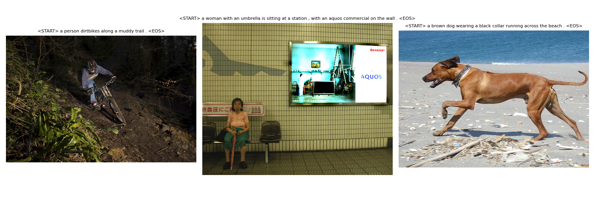

# Image Captioning with ResNet18 + LSTM

This project implements an image captioning model that generates natural language descriptions of images using a pretrained CNN encoder (ResNet18) and an LSTM decoder. The model is trained on the Flickr8k dataset and built end-to-end in PyTorch.

---

## Overview

* **Encoder**: ResNet18 (pretrained on ImageNet) extracts a 512-dimensional image embedding
* **Decoder**: LSTM generates captions conditioned on the image representation
* **Training**: Input-output pairs are derived from partial caption sequences
* **Inference**: Supports greedy decoding

This project demonstrates how to:

* Preprocess and align multimodal datasets (vision-to-text)
* Implement a full training + inference pipeline for a generative model

---

## Quick Start

### 1. Clone the repository

```bash
git clone https://github.com/TristanSpratt/image-captioning-lstm.git
cd image-captioning-lstm
```

### 2. Install dependencies

```bash
pip install -r requirements.txt
```

### 3. Download the Flickr8k dataset

* Request access and download from: [http://www.jair.org/media/3994/live-3994-7266-jair-fixed.pdf](http://www.jair.org/media/3994/live-3994-7266-jair-fixed.pdf)
* Place the extracted images and caption files in:

```
data/flickr8k/
├── Flickr8k.token.txt
├── Flickr_8k.trainImages.txt
├── Flickr_8k.testImages.txt
├── Flickr_8k.devImages.txt
└── Flickr8k_Dataset/
    ├── 1000268201_693b08cb0e.jpg
    └── ...
```

### 4. Train the model and generate sample captions

```bash
python demo.py
```

This will:
- Train the model on a small subset (100 images)
- Generate captions for 3 random images
- Save a grid of those images and their generated captions to:

```
outputs/captions/demo_grid.png
```

---

## Demo Results

Example outputs after training on 100 images for 3 epochs:



---

## Project Structure

```
image_captioning_project/
├── image_captioning.py       # Full training and inference pipeline
├── demo.py                   # Example script to train/test
├── README.md
├── requirements.txt
├── data/
│   └── flickr8k/             # Dataset
└── outputs/
    └── captions/            # Saved generated captions
```

---

## Device Compatibility

By default, the model will run on CPU. If you have a CUDA GPU, the script will automatically use it.

You can manually override the device in `image_captioning.py` by modifying the `DEVICE` configuration block:

```python
DEVICE = (
    'cuda' if torch.cuda.is_available()
    else 'mps' if torch.backends.mps.is_available()
    else 'cpu'
)
```

> ⚠️ Note: MPS (Mac GPU support) may not work correctly with LSTM. For best performance, use CUDA or CPU.

---

## Citations

### Flickr8k Dataset

> Hodosh, Young, & Hockenmaier (2013). *Framing Image Description as a Ranking Task: Data, Models and Evaluation Metrics*, Journal of Artificial Intelligence Research, Volume 47, pages 853-899  
> [http://www.jair.org/papers/paper3994.html](http://www.jair.org/papers/paper3994.html)

### ResNet18

> He, Zhang, Ren, & Sun (2016). *Deep Residual Learning for Image Recognition*. CVPR.

### TorchVision

> ResNet18 model from `torchvision.models` pretrained on ImageNet.

---

## Author

Tristan Spratt  
[www.tristanspratt.com](http://www.tristanspratt.com)
